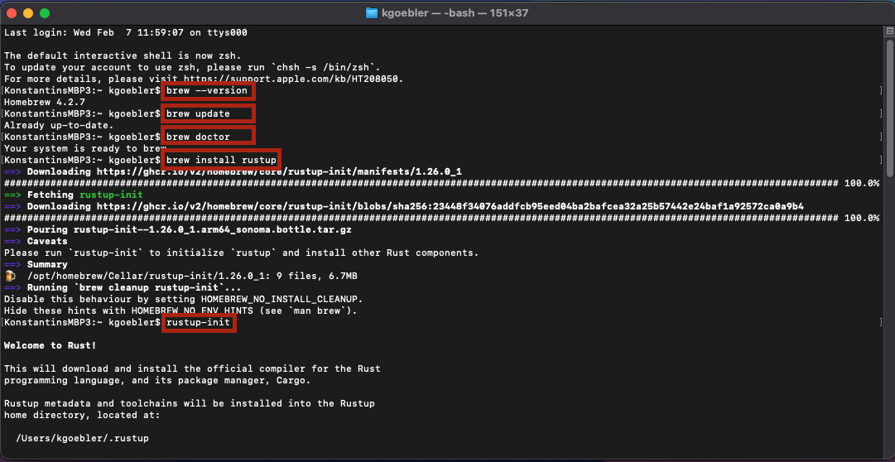
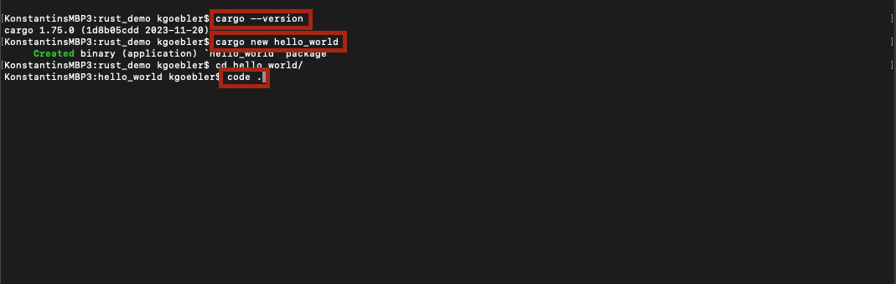
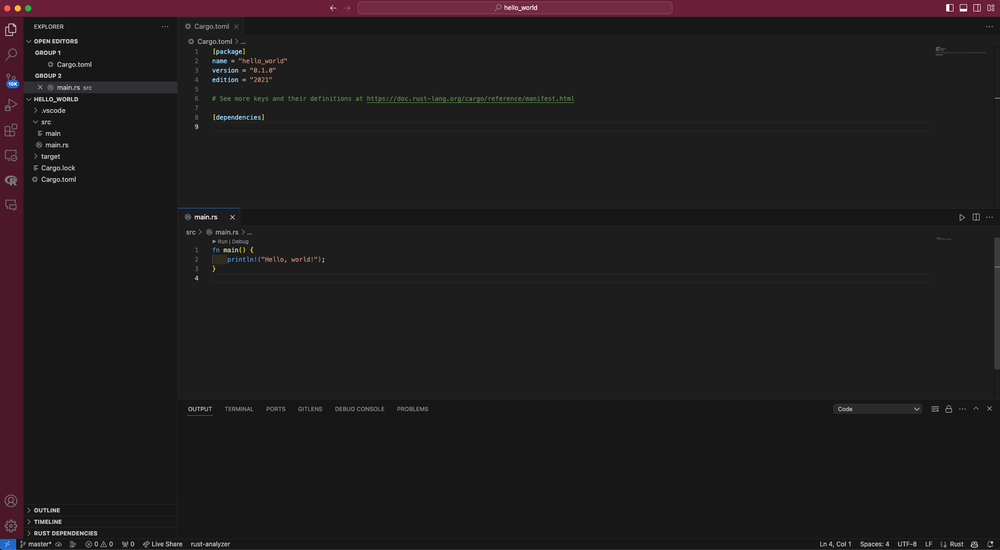
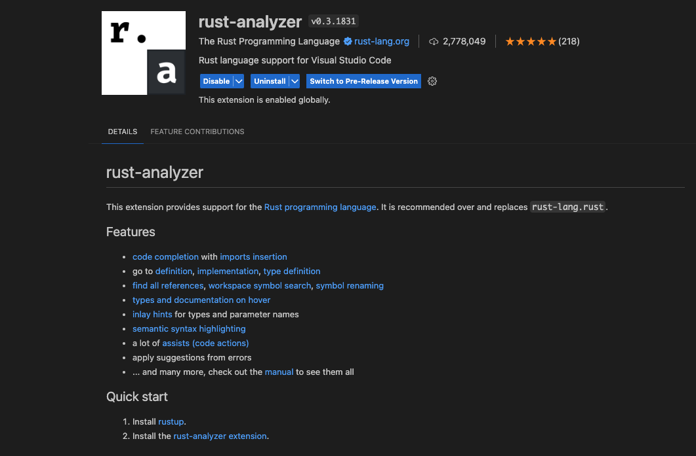
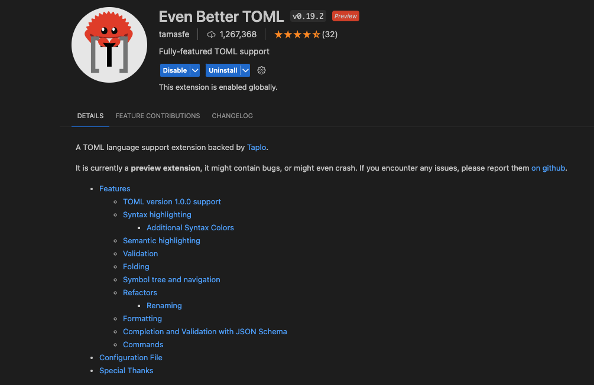
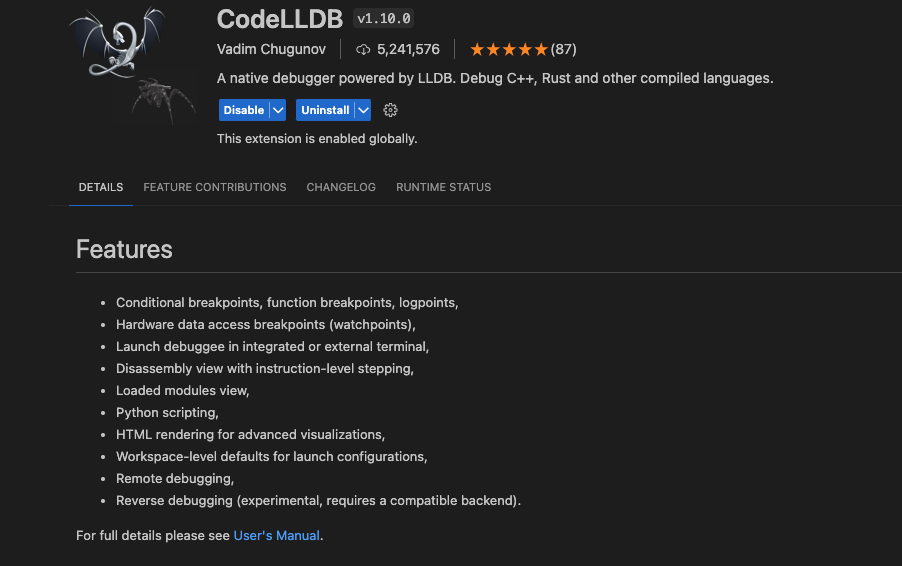
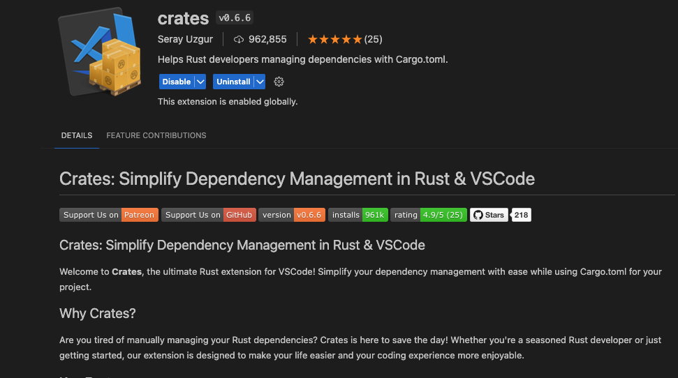
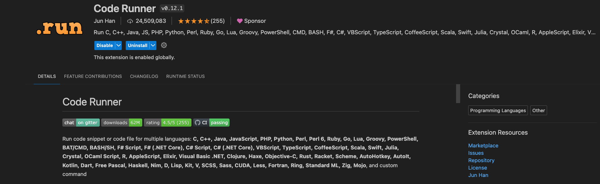

# Rust for statisticians

This file contains a demo of the Rust programming language. The setup assumes that users operate on `macOS`. However, as soon as `cargo` is installed, everything should be platform-independent.

## How to install using `homebrew`

If on macOS, `homebrew` makes installing packages very convenient, and I recommend using it. To install `homebrew` run:

        /bin/bash -c "$(curl -fsSL https://raw.githubusercontent.com/Homebrew/install/HEAD/install.sh)"

Check for success by typing `brew --version`. Next, run `brew upgrade` to upgrade and `brew doctor` to check whether you're ready to install anything new. Lastly, run:

        brew install rustup

After the command is finished, type

        rustup-init

You should see something similar to this:



After restarting your terminal, we're all set.

## How to manually install without `brew`

Installation on Linux or macOS can also be done directly in the terminal via:

        $ curl --proto '=https' --tlsv1.2 https://sh.rustup.rs -sSf | sh

Then, follow the guide on the official [website](https://doc.rust-lang.org/book/ch01-01-installation.html).

## Intro and first steps

Rust has been growing extensively and is for five years running the most "loved" programming language according to a 2020 developer [survey](https://insights.stackoverflow.com/survey/2020?utm_source=thenewstack&utm_medium=website&utm_content=inline-mention&utm_campaign=platform#technology-most-loved-dreaded-and-wanted-languages-loved) on  Stack Overflow:


Rust is a **statically** and **strongly** typed systems programming language. That means all types are known at compile time, which makes it close to impossible to write incorrect programs. While `R` and `Python` are interpreted high-level programming languages, `Rust` is a compiled language (similar to C++) and can be both high and low-level.

### Cargo

Cargo is Rust’s build system and package manager (they are called `crates` in Rust).
Check whether `cargo` is available in your terminal by typing `cargo --version`.

Let's dive right in and create a new project using `cargo`. First, create a new folder in your preferred location and then type:

        cargo new hello_world
        cd hello_world

You can use your favorite code editor to open the project. I work with VS Code, which supports working with many programming languages, including Rust. To open the `hello_world` program using VS Code, we simply type:

        code .

You should see something like this:


In VS Code, you should see this:


In VS Code, open a new terminal and `cargo build` the program. This command creates an executable file in `target/debug/hello_world`. We can then execute the built file by simply navigating to it:

        ./target/debug/hello_world

Sometimes, you might want to build and execute at the same time. Then, `cargo run` does these steps for you.

## Statistics in Rust

You might wonder why you should know and use Rust in the first place. In particular, if you're already using Python, R, or Julia. Is this not enough?
It will be in most cases. Whenever you perform operations that are memory-hungry and computationally expensive, you might want to consider implementing this
part of your code in Rust. In R, the community has, for the most part, relied on C++ for such tasks (in Python, there is CPython).

### Linear algebra demo

I will first demonstrate that Rust can be used for more than just printing *Hello World!* to the console.

        cd ..
        cargo new linear_algebra
        cd linear_algebra
        code .

As we can see, we still get the default *Hello World!* print statement in the `main.rs`. Now, let us delete this and replace it with the following:

```rust
use ndarray::arr2;

fn main() {
    let a = arr2(&[[1, 2, 3],
                   [4, 5, 6]]);

    let b = arr2(&[[6, 5, 4],
                   [3, 2, 1]]);

    let sum = &a + &b;

    println!("{}", a);
    println!("+");
    println!("{}", b);
    println!("=");
    println!("{}", sum);
}
```

We used a non-default crate in this program, namely `ndarray`. This is similar to Python's `numpy`, which does not ship with standard operations on arrays by default. To add this crate to the project, we need to tell `cargo`:

        cargo add ndarray

Notice the `.toml` file that gets updated automatically. Let's look at the code. We perform matrix addition here where $a$, $b$, and $sum$ are all $2 \times 3$ matrices. Notice that we need to tell Rust exactly what dimension the array has. The `&` operator represents *references*, and they allow you to refer to some value without taking ownership of it. This is called *borrowing* in Rust, and the concept goes beyond this little demo. Just remember: When we want to use values stored in some objects and not take ownership of them, we need to add `&`.

Let's see how matrix multiplication works:

```rust
use ndarray::arr2;

fn main() {
    let a = arr2(&[[1, 2, 3],
                   [4, 5, 6]]);

    let b = arr2(&[[6, 3],
                    [5, 2],
                    [4, 1]]);

    println!("a * b =");
    println!("{}", a.dot(&c));
}

```

Let us try to do some basic matrix inversion with some exception handling in case the matrix turns out to be singular. First, let's add the `nalgebra` crate to the project by typing

        cargo add nalgebra

Consider the following program:

```rust
use nalgebra::Matrix3;

fn main() {
    let m1 = Matrix3::new(2.0, 1.0, 1.0, 3.0, 2.0, 1.0, 2.0, 1.0, 2.0); // row-wise construction
    println!("m1 = {}", m1);
    match m1.try_inverse() {
        Some(inv) => {
            println!("The inverse of m1 is: {}", inv);
        }
        None => {
            println!("m1 is not invertible!");
        }
    }
}
```

## Linear Regression demo

Let's do something slightly more involved and run some linear regression on toy data.
First, create a new project

        cd ..
        cargo new linear_regression
        cd linear_regression
        code .

As you might guess, we'll add some crates to the project:

                cargo add rand, rand_distr

Then we define a bivariate regression model using the following program:

```rust
use rand::prelude::*;
use rand_distr::{Distribution, StandardNormal};

pub struct LinearRegression {
    pub slope: f64,
    pub intercept: f64,
}

fn main() {
    // Create a new instance of the LinearRegression struct
    let mut linear_regression_model =LinearRegression::new();
    println!("Slope: {}", linear_regression_model.slope);

    //create toy data:
    let mut rng = thread_rng();

    let x: Vec<f64> = StandardNormal.sample_iter(&mut rng).take(100).collect();
    let epsilon: Vec<f64> = StandardNormal.sample_iter(&mut rng).take(100).collect();
    let true_b1 = 2.5;
    let true_b0 = 2.0;
    let y: Vec<f64> = x.iter().map(|x| &true_b1 * x + &true_b0).collect::<Vec<f64>>();
    let y: Vec<f64> = y.iter().zip(epsilon.iter()).map(|(x, e)| x + e).collect();

    println!("y: {:?}", y);

    linear_regression_model.fit(x, y);
    println!("The slope is {}",linear_regression_model.slope);
    println!("The intercept is {}",linear_regression_model.intercept);

}

impl LinearRegression{
    // make new() method available
    pub fn new() -> LinearRegression {
        LinearRegression {
            slope: 0.0,
            intercept: 0.0,
        }
    }
    // we will add the fit method here
    pub fn fit (&mut self,x:Vec<f64>,y:Vec<f64>) {
        // exit if the sample size is different
        if x.len()!=y.len(){
            panic!("The number of input and output values is different");
        }
        let n=x.len();
        // iterators are evaluated lazily, so we need to call sum() to get the actual value
        let sum_x:f64=x.iter().sum::<f64>();
        let sum_y:f64=y.iter().sum::<f64>();

        let sum_of_x_y=x.iter().zip(y.iter()).map(|(&x, &y)| x * y).sum::<f64>();
        let square_sum_x=x.iter().map(|&x|x*x).sum::<f64>();

        //get beta_1 and beta_0
        self.slope=(n as f64*sum_of_x_y-sum_x*sum_y)/(n as f64*square_sum_x-sum_x*sum_x);

        self.intercept=(sum_y*square_sum_x-sum_x*sum_of_x_y)/(n as f64*square_sum_x-sum_x*sum_x);
    }
}
```

This concludes this demo. I left out many, many concepts. From this point on, you should be well-equipped to explore yourself.

### Some VS Code details

To use Rust in VS Code, I recommend installing the following extensions:

1. rust-analyzer


2. Even better TOML, to improve `.toml` file handling


3. CodeLLDB for debugging purposes


4. crates for version handling of Rust crates


In general, I recommend using the `code-runner` extension in VS Code. This allows you to automatically send your code to a new terminal and run it in the background.



We need a little hack to prioritize `cargo run` in the code-runner for Rust code. Open your user settings (JSON) and add the following line:

```json
"code-runner.executorMap": {
        "rust": "cargo run # $fileName",
},
```
Now you're all set and good to go.